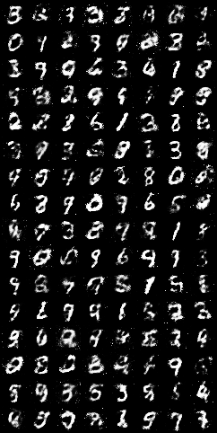
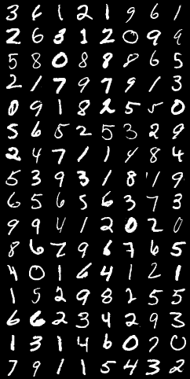

## Observation

Training discriminator for K steps following the provided algorithm gives better result in eariler epochs.

## Results

Result of the python code with, 

```
self.batch_size = 128
self.num_epochs = 100
self.K = 3 
```




## Result Improvement

- Try deeper and complex networks.
- Use convolutional neural networks.
- Try batch normalization, dropout, different activation funcitons.

## References

- Original GAN paper, https://arxiv.org/abs/1406.2661
- Code this is based on with explanation, https://www.youtube.com/watch?v=OljTVUVzPpM
